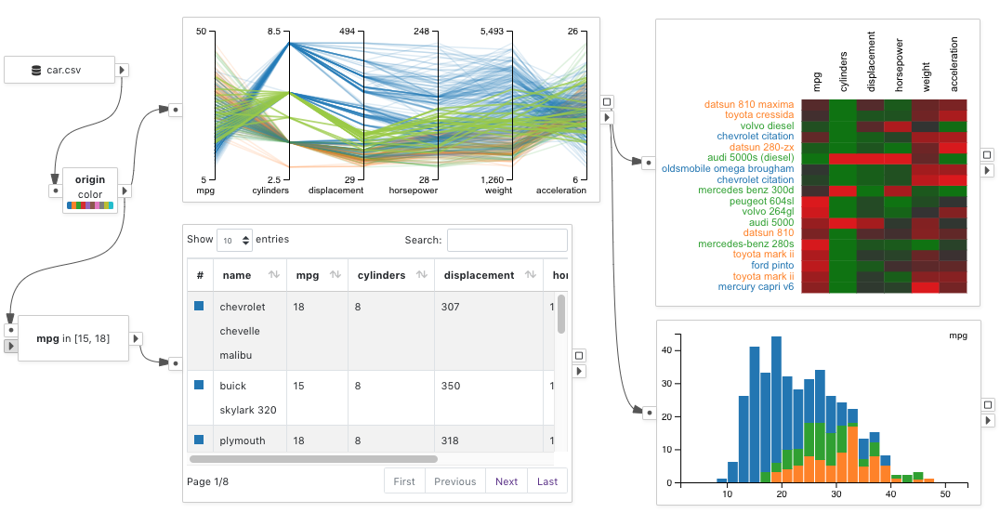

# Dataflow Diagram

The dataflow diagram defines VisFlow works to transmit, process, and visualize the data.
A dataflow diagram consists of nodes and directed edges.
It is topologically a directed acyclic graph (DAG).
The dataflow diagram in VisFlow follows the [subset flow](/dataflow/subsetflow.md) model.

Below shows a sample diagram that presents a set of visualizations of the car dataset.

## Node
A node is a primitive component in VisFlow that performs one type of tasks.
For example, a <node-type type="data-source"/> loads a tabular dataset and a <node-type type="scatterplot"/> charts the data using 2D scatterplot.
A node has input and output data that are transmitted via [ports](#port).

## Port
A node has ports located on its two sides.
The <port-type type="input" text="Input Ports"/> of a node are located on the left.
The <port-type type="output" text="Output Ports"/> of a node are located on the right.
Ports are connected by [edges](#edge).

The connectivity of a port is either `single` <port-type type="input" text=""/> or `multile` <port-type type="multi-input" text=""/>.
A `single` port may be connected with at most one edge.
A `multiple` port may have unlimited number of connections.
All output ports are `multiple` ports.

If an output port produces interactive selection from a [visualization](/dataflow/visualization.md),
it is a <port-type type="selection"/>.

## Edge
An edge defines how data are transmitted between nodes in VisFlow.
Each edge connects two ports, and goes from an output port of the source node to an input port of the target node.

## Subset
The majority of data transmitted between VisFlow nodes are _subsets_ of the input tabular data.
Each row of the input table is considered to be a _data item_.
The group of data items that is transmitted is therefore a _subset_ of the input table.

VisFlow employs a [subset flow](/dataflow/subsetflow.md) model for its dataflow diagrams.
The attribute values and table columns of a data item cannot be changed within the flow, except that [visual properties](#visual-property) can be associated with a data item.
For any data item from a subset, it always corresponds to one row from an input table.

## Constant
A _constant_ in VisFlow is defined to be one constant value that can be a number, a string, or a date.
A list of constants can be transmitted between VisFlow nodes via edges connecting a pair of <port-type type="constants" text="Constants Ports"/>.
Constants can either by manually specified by a user, or extracted from input tables.

Constants can be used to perform attribute filtering.
For example, an <node-type type="attribute-filter"/> may perform range filtering by accepting two constants that define the filtering range.

Constants may also be used as keys to relate heterogeneous tables.
See [linking](/dataflow/linking.md) for more details.

## Visual Property
Visual properties may be assigned to data items in the dataflow using a <node-type type="visual-editor"/> so as to identify and trace data subsets.
Visualizations in VisFlow respect the visual properties of data items and renders the data according to their visual properties.
Each visualization may have its own way of showing the visual properties.
See [node types documentation](/dataflow/visualization.html#visualization-types) for how each type of visualization renders the visual properties.

Each data item carries its own visual properties.
These properties can be updated and modified by nodes in the dataflow.
When two tables are merged by a <node-type type="set-operator"/>, the visual properties of each data item are also merged.

Currently VisFlow supports five types of visual properties: <ui-value text="color"/>, <ui-value text="border"/>, <ui-value text="width"/>, <ui-value text="size"/>, and <ui-value text="opacity"/>.
