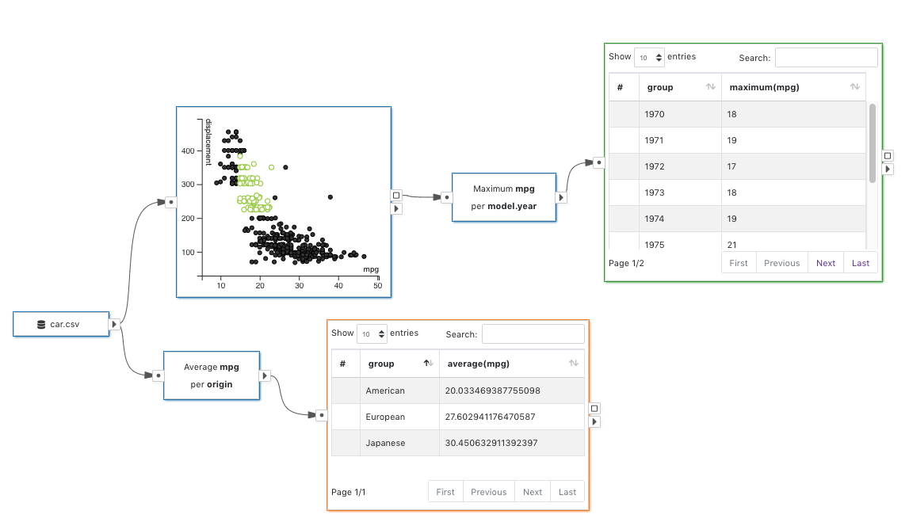

# Subset Flow

The flow diagrams in VisFlow follow the subset flow model.
The subset flow model requires all input and output data of the nodes must be a subset of table rows from an input table.
By the subset relation, VisFlow is able to uniquely identify a data item and assign visual property to it.
There is no ambiguity in changing the visual properties by a <node-type type="visual-editor"/>, or inheritting the visual properties when merging table in a <node-type type="set-operator"/>.
Consequently, relying on the visual properties the visualizations in VisFlow may render data subsets in consistent styles across nodes and provide native brushing and linking.

The [constants](/dataflow/diagram.html#constant) produced by a <node-type type="constants-generator"/> or <node-type type="linker"/> are the only type of data that are not subsets in VisFlow.
Constants allow VisFlow to use the attribute values of the data items for filtering, so as to perform more in-depth data analysis.
Using constants, VisFlow may [link](/dataflow/linking.md) heterogeneous tables by a shared key column.

## Data Immutability

The subset flow model restricts data modification within the system.
For example, a VisFlow node cannot add a data column to the table, which would create table rows that do not belong to any of the input tables of the system.
This would introduce ambiguity in assigning visual properties, and hinders subset brushing and highlighting.
Despite some limitation on the data processing capability, the subset flow model has the advantages of reducing the flow diagram complexity, and making subset tracking and comparison easier.
We recommend preprocessing and modifying data before loading them into VisFlow, as VisFlow is not meant to be a data processing tool anyway.
Visflow is more suitable for fast launch data visualization and data exploration on preprocessed data.

For example:
- If a clustering algorithm is to be studied, we may add a column for the cluster labels produced by the clustering algorithm and load the table with a cluster label column into VisFlow.
- If aggregation is needed on the data, we can aggregate them using database query or custom script outside VisFlow and load the aggregated table into VisFlow.

That said, we do observe that being able to mutate the data may significantly increase the analytical capability of the dataflow framework.
Therefore the VisFlow beta features now support [extended subset flow](#extended-subset-flow), which allows data mutation nodes in the dataflow.

## Extended Subset Flow

The extended subset flow model allows certain nodes in the dataflow to mutate data.
For example, an aggregation node can thus be used to compute the average values.
These data mutating node types are supported in the VisFlow beta features.
To enable the beta features, in the <ui-button text="Options" dropdown/> dropdown of the navbar, select <ui-button text="Enable Beta Features"/>.
You may see the node list on the left displays more node types.

Once the data mutated, visual properties can no longer be inheritted.
Thus the subset flow must stop at the data mutating nodes to avoid ambiguity in visual property rendering, which would create data mutation boundaries.
The subset flow applies to the data that do not go though a data mutation boundary.
You may use all the original VisFlow features within a group of nodes within a same data mutation boundary.
To see a clear indication of where the data get mutated, enable <ui-button text="Data Mutation Boundary"/> in the <ui-button text="Options" dropdown/> dropdown.
The nodes that keep data immutability will be shown with borders of a same color.

