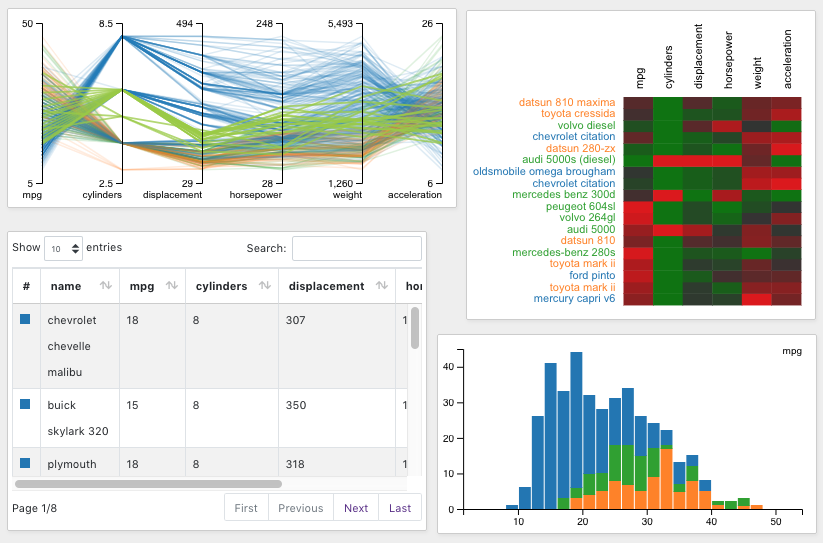

# VisMode Dashboard

VisFlow features _Visualization Mode (VisMode)_, in which only selected nodes (typically visualizations) are shown and the other diagram details are hidden, presenting a dashboard that can be useful for presentation or result sharing.
The following figure shows the VisMode dashboard generated from the dataflow diagram in this [example](./diagram.md).

Press the VisMode switch button <ui-button icon-classes="fas fa-video" text=""/> at the top-right of the navbar to switch between diagram editing and VisMode dashboard.

To configure which nodes are visible in the VisMode, click the VisMode toggle <ui-button icon-classes="fas fa-tv" text=""/> in the option panel.
By default, all visualizations are visible in the VisMode.
