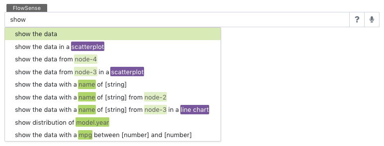
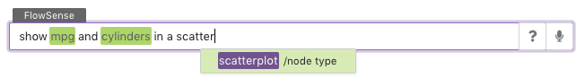
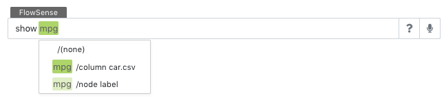

# FlowSense

_FlowSense_ is the natural language interface that assists with dataflow diagram editing in VisFlow.
To use FlowSense, right click on the canvas or a diagram element and choose <ui-button text="FlowSense"/>.
You may also press the shortcut <shortcut-key :keys="['shift', 'S']"/> to open the FlowSense input.

## Examples
The input provided to FlowSense must be a natural language sentence that specifies a diagram editing operation.
Some example inputs include (in the context of the cars dataset):
- draw a plot
- show the cars
- create a <fs-tag type="node-type" text="scatterplot"/> of <fs-tag type="column" text="mpg"/> and <fs-tag type="column" text="cylinders"/>
- show a <fs-tag type="node-type" text="parallel coordinates"/> for all the columns
- show <fs-tag type="column" text="GDP(Billion US$)"/> series over <fs-tag type="column" text="year"/> grouped by <fs-tag type="column" text="Country Code"/>
- visualize the distribution of <fs-tag type="column" text="mpg"/>
- find the cars with maximum <fs-tag type="column" text="mpg"/>
- sample 5 percent of the cars
- find cars with <fs-tag type="column" text="mpg"/> between 15 and 20
- highlight the selected data in a <fs-tag type="node-type" text="histogram"/>
- set opacity to 0.5
- encode <fs-tag type="column" text="mpg"/> by red green color scale
- map <fs-tag type="column" text="horsepower"/> to size from 1 to 5
- merge the data from <fs-tag type="node-label" text="node-1"/> with <fs-tag type="node-label" text="node-2"/>
- find the cars with a same <fs-tag type="column" text="name"/> from <fs-tag type="node-label" text="node-1"/>
- link the cars by <fs-tag type="column" text="name"/> from <fs-tag type="node-label" text="node-1"/>
- load <fs-tag type="dataset" text="car.csv"/>

## Functionality
FlowSense facilitates diagram editing and its main goal is to facilitate node and edge creation along with visual property editing.
But it may also perform some helper tasks such as loading datasets, adjust diagram layout, etc.

The functionality FlowSense performs can be categorized into the following FlowSense _functions_:
| Function | 
Sample Query
 | Description |
|:---:| --- | --- |
| Visualization | show a <fs-tag type="node-type" text="scatterplot"/> of <fs-tag type="column" text="mpg"/> and <fs-tag type="column" text="horsepower"/> | Create a visualization to present the data |
| Visual Encoding | encode <fs-tag type="column" text="mpg"/> by red green color scale | Map data attributes to visual properties |
| Attribute Filtering | find the cars with <fs-tag type="column" text="mpg"/> between 15 and 20 | Filter data items by attribute values |
| Subset Manipulation | merge the data from <fs-tag type="node-label" text="node-1"/> with <fs-tag type="node-label" text="node-2"/> | Refine and identify subsets of interest |
| Highlighting | highlight the selected cars in a <fs-tag type="node-type" text="histogram"/> | View the characteristics of one subset among its superset or another subset |
| Linking | find the cars with a same <fs-tag type="column" text="name"/> from <fs-tag type="node-label" text="node-1"/> | Perform <page-link link="/dataflow/linking" text="linking"/> between two tables |
| Data Loading | load <fs-tag type="dataset" text="car.csv"/> | Create a data source to load a given dataset |
| Layout Adjustment | adjust the diagram layout | Automatcially adjust dataflow diagram layout |

## Special Utterances
Some words in the natural language input has special meanings in the dataflow context.
FlowSense identifies these words and explicitly tags them in the user interface.
Four types of tags are identified:
<fs-tag type="column" text="data column"/>,
<fs-tag type="node-type" text="node type"/>,
<fs-tag type="node-label" text="node label"/>,
and <fs-tag type="dataset" text="dataset"/>.

When a query is being typed, auto completion helps find those special utterances that are commonly used in natural language queries, as show in the following figure:

Pressing the <shortcut-key :keys="['up']"/><shortcut-key :keys="['down']"/> and <shortcut-key :keys="['tab']"/> keys to select between the suggested words.

Under very rare circumstances, if a word has ambiguous meaning and can be tagged as different types of special utterances, click on the tagged word to manually select an intended tag:

## Query Syntax
A natural language query consists of the following essential parts:

### Function Type
A verb should be given to specify which type of FlowSense function to perform.
Example verbs include `show`, `draw`, `filter`, `highlight`, `set`, etc.
Among those, `show`, `draw` perform visualization functionality,
`filter` performs attribute filtering,
`highlight` performs selection highlighting,
and `set` assigns visual properties.

### Function Options
The query may include additional descriptors to describe how a FlowSense function should be performed.
For example, "show <fs-tag type="column" text="mpg"/> and <fs-tag type="column" text="cylinders"/>" decribes two columns to visualize, which are parsed as options to be configured on the created visualization node.
"encode <fs-tag type="column" text="mpg"/> by red green color scale" describes the creation of a <node-type type="visual-editor"/>.
Additionally, it indicates that the visual editor should be in <page-link link="/node/visual-editor.html#encoding" text="Encoding"/> <ui-prop node-type="visual-editor" prop="mode"/>, and map the <fs-tag type="column" text="mpg"/> <ui-prop node-type="visual-editor" prop="column"/> to a red green color scale.

### Subset Condition
The query may includes a _condition_ to operate on a subset of the data.

A condition may describe an attribute filtering requirement.
For example, "cars with <fs-tag type="column" text="mpg"/> between 15 and 20" finds a subset of cars with a condition on the <fs-tag type="column" text="mpg"/> values and implies the usage of an <node-type type="attribute-filter"/>.
FlowSense automatically determines if a filter should be created for a condition.

A condition may also describe interactive selection.
For example, "selected cars" indicates that the query should be performed on output of the <port-type type="selection"/> of a visualization node.
In this case the dataflow diagram is extended from the selection port.

### Target Node
When the query operates on a subset, it may optionally indicate a target node where the subset should be sent to.
For example, "in a <fs-tag type="node-type" text="scatterplot"/>" indicates that the subset should be visualized in a <node-type type="scatterplot"/>.

When no target node is explicitly given, FlowSense automatically determines if a target node should be created.
For example, FlowSense creates a plot upon "show the data" or "show <fs-tag type="column" text="mpg"/>" and chooses a best visualization type depending on the number of columns to show.

### Source Node
A query may optoinally specify a source node to indicate where the subset to operate on comes from.
For example, "show the selected cars from <fs-tag type="node-label" text="plot-1"/>" describes that the data to show comes from the <port-type type="selection"/> of <fs-tag type="node-label" text="plot-1"/>.
Here <fs-tag type="node-label" text="plot-1"/> is a node label that refers to a visualization node in the dataflow diagram.

## Auto Completion
FlowSense provides suggestions on partially completed queries automatically.
You may also use the suggestion button <ui-button icon-classes="fas fa-question" text=""/> on the right of the FlowSense input box for suggested queries.

## Voice Input
Press the voice button <ui-button icon-classes="fas fa-microphone" text=""/> to enable voice input to the FlowSense input box.
When voice is enabled, speak to the microphone and the query will be recorded into the input box.
Press <shortcut-key :keys="['enter']"/> to submit the query.
