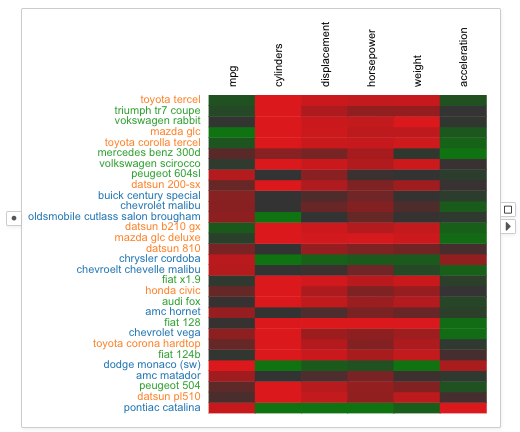

# Heatmap

A <node-type type="heatmap"/> renders a set of chosen columns of the data items using color encoded cells.
Each row represents one data item.
The heatmap cells are colored based on attribute values in each column and the chosen color scale.
The values in each column are normalized to the minimum and maximum values in that column.

One column from the data can be used to show data item labels, configured by <ui-prop prop="row-label-column"/>.

## Example

A heatmap showing six columns of 30 cars from the cars dataset.
The colors of the cars are encoded by their origin countries and reflected by the row labels.

## Selection
Seletion in the heatmap is over the heatmap rows.
Drag and draw a rectangular box to select the rows within the box.

## Visual Properties

Since a heatmap has its own color encoding for attribute values, visual properties of data items are reflected by the rendering styles of row labels.

| Type | Effect |
|:----:| ------ |
| color | Color of the row label |
| border | Border color of the heatmap cell, border color of the row label |
| size | Not suppoted |
| width | Width of the heatmap cell border |
| opacity | Not supported |

## Options
### Columns
Configures which columns to show in the heatmap.

### Color Scale
Configures the color scale applied for the heatmap cells.

### Sort By
Orders the heatmap rows by increasing values in this column.

### Row Label Column
Displays row labels with the values in this column.

### Column Labels
Shows/hides column names on top of the heatmap.
