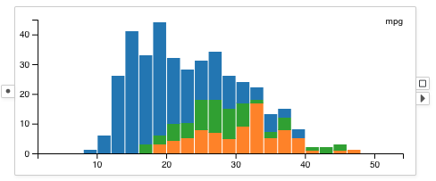

# Histogram

A <node-type type="histogram"/> renders the distribution of data items on one selected column.
dlfkjsdlf
dlfkjsdlf
dlfkjsdlf
dlfkjsdlf
dlfkjsdlf
dlfkjsdlf

## Example

A histogram showing the mpg distribution of the cars:
The bars in the histogram are color encoded by the origin countries of the cars and shown as stacked bars.

## Selection
Selection in the histogram is performed on the stacked bars.
Groups of data items with exactly the same visual properties are selected together.

## Visual Properties
| Type | Effect |
|:----:| ------ |
| color | Fill color of the bar |
| border | Border color of the bar |
| size | Not supported |
| width | Width of the bar border |
| opacity | Opacity of the bar |

## Options
### Column
Configures the column for which the distribution is shown for.

### Number of Bins
Configures the approximate number of bins to create.
The chart may choose a number close to the given value that has the best readability.
