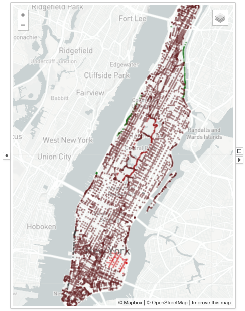

# Map

A <node-type type="map"/> renders a set of geographical points on a map display.
Each data item is presented as a circle on the map.
The <ui-prop prop="latitude-column">Latitude Column</ui-prop> and the <ui-prop prop="longitude-column">Longitude Column</ui-prop> define the geographical coordinates of the data items.

## Example

A map showing the speed sign locations in Manhattan area of New York City.
The speed signs are color encoded by the speed limit.
Red color indicates lower speed limit, while green color indicates faster speed limit.
The circles are drawn with `0.5` opacity to reflect speed sign density.

## Selection
Drag and draw a rectangular box on the map to select the data items inside the box when the map is not in the <ui-prop prop="navigation">Navigation</ui-prop> mode.

## Visual Properties
| Type | Effect |
|:----:| ------ |
| color | Fill color of the circle |
| border | Border color of the circle |
| size | Diameter of the circle |
| width | Width of the circle border |
| opacity | Opacity of the circle |

## Options
### Latitude Column
Configures the column to use as the latitude coordinate.

### Longitude Column
Configures the column to use as the longitude coordinate.

### Navigation
When navigation is on, dragging in the map area performs zooming and panning.
When navigation is off, dragging in the map area makes a rectangular selection.
