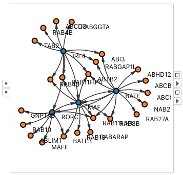

# Network

A <node-type type="network"/> renders a network visualization based on graph input.
A network accepts two input tables: one for the nodes, and the other for the edges.
The two tables must share columns with node identifiers.
The network uses <ui-prop prop="edge-source-column"/> and <ui-prop prop="edge-target-column"/> as node identifiers to relate edges to the nodes.

As the network node receives two tables, there are correspondingly four output ports.
From the top to the bottom on the right of the network,
the first two ports are the <port-type type="selection"/> and <port-type type="output"/> of the nodes,
and the second ports are the <port-type type="selection"/> and <port-type type="output"/> of the edges.

## Example

A network showing color encode nodes.
This is a gene regulatory network in which blue nodes are genes that are of a special category called the Transcription Factors.
The node table is of the format:

| name | isTF |
| --- | --- |
| BATF | yes |
| RORC | yes |
| ... | ... |
| ABCB9 | no |
| ABCD3 | no |
| ... | ... |

The edge table is of the format:

| source | target | confidence_score |
| --- | --- | --- |
| BATF | RORC | 1.954587 |
| BATF | ABCB9 | 1.612152 |
| ... | ... | ... |

The <ui-prop prop="node-id-column"/> is <ui-value text="name"/> from the node table.
The <ui-prop prop="edge-source-column"/> is <ui-value text="source"/> from the edge table.
The <ui-prop prop="edge-target-column"/> is <ui-value text="target"/> from the edge table.

## Selection
Drags and draws a rectangular box to select the nodes and edges inside or partially inside the box when the network is not in the <ui-prop prop="navigation"/> mode.

## Visual Properties

### Nodes
| Type | Effect |
|:----:| ------ |
| color | Fill color of the circle |
| border | Border color of the circle |
| size | Diameter of the circle |
| width | Width of the circle border |
| opacity | Opacity of the circle |

### Edges
| Type | Effect |
|:----:| ------ |
| color | Color of the edge curve and arrow |
| border | Not supported |
| size | Not supported |
| width | Stroke width of the edge curve and arrow |
| opacity | Opacity of the edge curve and arrow |

## Options

### Node ID Column
Configures the column to use as the node identifier from the node table.

### Edge Source Column
Configures the column to use as the source node identifier from the edge table.

### Edge Target Column
Configures the column to use as the target node identifier from the edge table.

### Node Label Column
Configures the column to use as the node label from the node table.

### Edge Distance
Speificies the desired distance between two nodes that are directly connected by an edge.

### Navigation
When navigation is on, dragging in the network area performs zooming and panning.
When navigation is off, dragging in the network area makes a rectangular selection.
