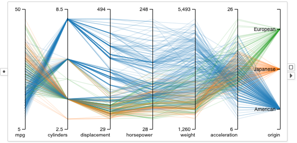

# Parallel Coordinates

A parallel coordinates plot renders several columns together.
Each column is represented using a vertical axis.
Each data point is a polyline connecting to the axes.
The location where a polyline intersects an axis correspond to the attribute value of the data item on that column.

## Example

A parallel coordinates plot showing seven columns from the cars table.
The lines are color encoded by the origin countries of the cars.

## Selection
Draw a stroke in the parallel coordinates to select data items of which the polylines intersect the stroke.

## Visual Properties
| Type | Effect |
|:----:| ------ |
| color | Color of the polyline |
| border | Not supported |
| size | Not supported |
| width | Width of the polyline |
| opacity | Opacity of the polyline |

## Options
### Columns
Configures which columns to display in the parallel coordinates.
The axes for the columns are shown from left to right.
