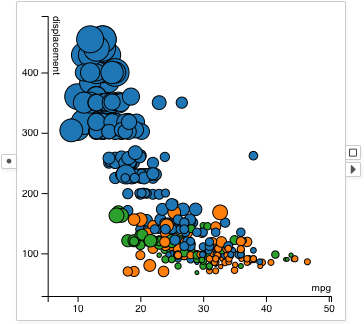

# Scatterplot

A <node-type type="scatterplot"/> renders a scatterplot chart with two axes,
presenting a visualization for two columns of the data.
Each data point is represented by a circle.

## Example

A scatterplot showing mpg and displacement of cars:
The sizes of the circles represent the horsepower of the cars.
The colors of the circles represent the origin countries of the cars.

## Selection
Drag and draw a rectangular selection box to select data items inside the box.

## Visual Properties
| Type | Effect |
|:----:| ------ |
| color | Fill color of the circle |
| border | Border color of the circle |
| size | Diameter of the circle |
| width | Width of the circle border |
| opacity | Opacity of the circle |

## Options
### X Column
Configures the column visualized on the X-axis.

### Y Column
Configures the column visualized on the Y-axis.

### Disable Transition
Disables the animation between data updates.

### Use Dataset Range
Sets the axes domain to always equal to the value ranges of the entire dataset,
rather than the value ranges of the subset received by the scatterplot.

### Axis Margin
Uses 10% of margin on both sides of the axes.
