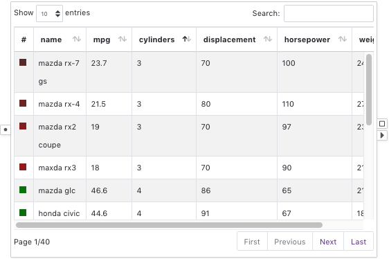

# Table

A <node-type type="table"></node-type> lists the attribute values of the data items in a table display.
The <ui-prop prop="columns">Columns</ui-prop> to be shown in the table can be adjusted using the option panel.
The first column of the table shows the visual properties of the data.

## Example

A table showing the car dataset:
The first column shows the color visual properties of the cars.
The colors are encoded by the mpg values of the cars using a red-green color scale.

## Selection
Click the rows to select data items.

## Visual Properties

| Type | Effect |
|:----:| ------ |
| color | Color of the box in the visual property column |
| border | Border color of the box in the visual property column |
| size | Not supported |
| width | Not supported |
| opacity | Not supported |

## Options

### Columns
Configures which columns to display in the table display.
The columns are listed from left to right in the table display.
